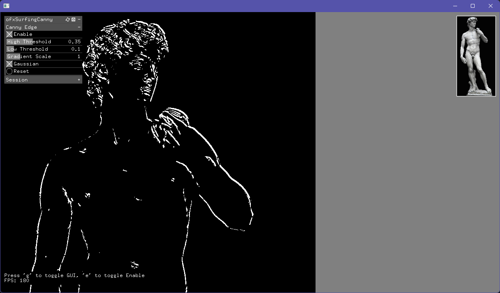

# ofxSurfingCanny
> [!WARNING]
> WIP

*Edge detection algorithm based on an Edge Canny Detection shader add-on.
Developed for seamless integration with AI workflows and real-time 3D applications.*



> [!NOTE]
> This add-on is based on [ofxEdgeCannyDetector](https://github.com/pierrextardif/ofxEdgeCannyDetector) from [pierrextardif](https://github.com/pierrextardif). Thanks!
Check original information here: [README.md](https://github.com/pierrextardif/ofxEdgeCannyDetector/blob/master/README.md).

## Added Features
- Customize threshold parameters
- Improved API.
- Persistent `json` settings (preset & session)
- Improved UI workflow

## Quick Start

```cpp
// ofApp.h

#include "ofMain.h"
#include "ofxSurfingCanny.h"

ofxSurfingCanny canny;
ofImage img;

//--

// ofApp.cpp

// setup()
canny.setup();
img.load("TheDavid.png");

// udate()
canny.begin();
{
  img.draw();
}
canny.end();

// draw()
canny.draw();
canny.drawGui();

```

## Key Parameters

### ofParameter settings
- High Threshold
- Low Threshold
- Gradient Scale
- Gaussian

## Export file (TODO)

- Output: 1024x1024 RGBA
- File format: PNG
- Export image files to custom folders (ie: `D:/ComfyUI/input/canny/`).

## Dependencies

- openFrameworks 0.12.1+
- ofxGui

## Tested Systems
- Windows 11 / VS 2026 Insiders / of_v0.12.1_vs_64_release

## Use Cases

- **ControlNet Canny**: Real-time process and generate canny image files for AI image generation
- More info: https://docs.comfy.org/tutorials/flux/flux-1-controlnet

## TODO
- Export
